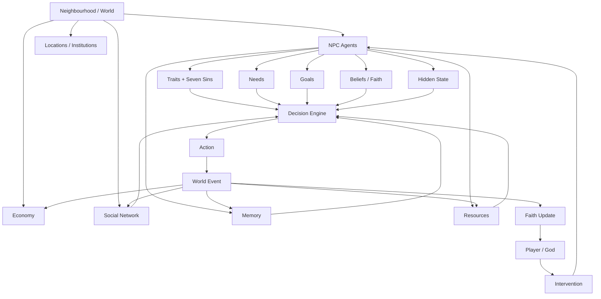
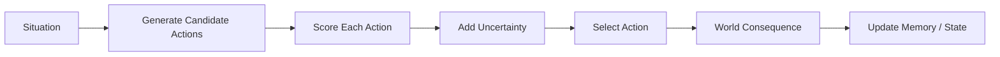
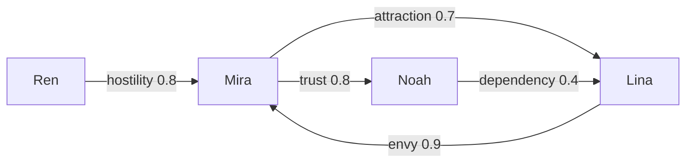
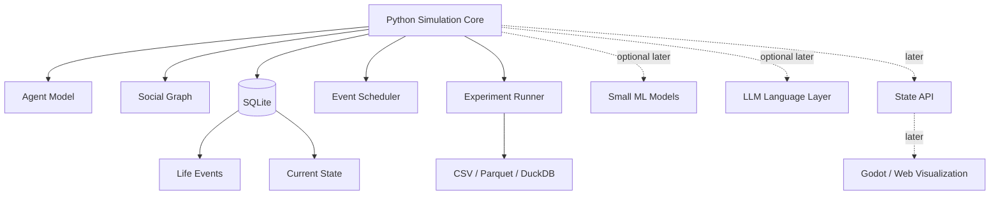

# The Playing God — Archived Vision 0.1

> Historical snapshot. Superseded by `docs/ROADMAP.md`; this document's version number is not a project phase.
## Project Brief for a Master of Computer Engineering Thesis

**Working Title:**  
**The Playing God: An Agent-Based Simulation of Emergent Life Trajectories under Behavioral Drives, Social Dynamics, Belief, and External Intervention**

**Project Type:**  
Master's Thesis / Agent-Based Simulation / Computational Social System / AI Experimentation Platform

**Primary Goal:**  
Build a lightweight simulation in which autonomous NPCs develop distinct life trajectories from internal traits, needs, social relationships, economic constraints, memories, beliefs, and limited external interventions by a player acting as a "god."

---

# 1. Vision

**The Playing God** is a simulated neighbourhood populated by autonomous artificial characters.

Each NPC has:

- identity
- personality
- behavioral drives
- seven deadly sin attributes
- needs
- goals
- money and resources
- occupation and status
- memories
- relationships
- hidden internal states
- beliefs
- faith
- personal history
- evolving future trajectory

The player does not directly control NPCs.

Instead, the player observes them, studies their histories, sees selected high-level information that the NPCs themselves cannot see, and occasionally influences their lives through indirect interventions such as:

- dreams
- signs
- opportunities
- blessings
- warnings
- coincidences
- misfortune

NPCs may obey, misunderstand, reinterpret, ignore, or never notice these interventions.

The purpose is not to create a scientifically accurate model of the human soul. The project studies how simple computational behavioral rules can interact to produce complex, divergent life trajectories.

---

# 2. Core Thesis Idea

The research system can be summarized as:

```text
internal drives
    ↓
decision
    ↓
action
    ↓
consequence
    ↓
memory + relationship changes + resource changes
    ↓
new internal state
    ↓
next decision
```

The player introduces an additional feedback loop:

```text
NPC desire / prayer
        ↓
player observes
        ↓
optional intervention
        ↓
NPC interpretation
        ↓
behavior changes
        ↓
outcome
        ↓
belief / faith changes
```

The interesting behavior should emerge from interactions between systems rather than from manually scripted stories.

---

# 3. Research Position

The thesis should **not** claim:

> "This project accurately simulates human psychology."

A stronger and more defensible claim is:

> "This project investigates how heterogeneous behavioral drives, economic constraints, memories, social relationships, belief systems, and sparse external interventions can generate divergent emergent trajectories in an agent-based artificial society."

Potential research question:

> **How do heterogeneous behavioral attributes, resource constraints, social relationships, memory, and belief influence emergent life trajectories in an artificial society, and how strongly can sparse external interventions alter those trajectories?**

Possible sub-questions:

1. How strongly do different internal attributes influence long-term outcomes?
2. How do social networks amplify or suppress individual behavior?
3. How much can a single intervention alter an agent's long-term trajectory?
4. When does belief in an external actor emerge or disappear?
5. How do identical interventions produce different outcomes across agents?
6. How predictable are individual trajectories from initial attributes?

---

# 4. Thesis Boundary

The project must remain achievable on limited hardware and limited API budget.

## Thesis MVP

| Component | Initial Scope |
|---|---:|
| World | 1 neighbourhood |
| NPC population | 10 during prototype, 50-200 during thesis experiments |
| Important locations | 5-20 |
| Job categories | 5-15 |
| Needs | 5-8 |
| Seven deadly sins | 7 continuous attributes |
| Relationship dimensions | 3-6 |
| Simulation length | Months to several simulated years |
| Player interventions | 3-6 types |
| Visualization | Debug UI / simple map first |
| LLM dependency | Optional |
| Cloud infrastructure | None required |

## Explicitly Out of Scope for the Early Thesis

- photorealistic city simulation
- thousands of LLM-powered NPCs
- real-time voice conversations
- complex physics
- large neural-network training
- massive distributed infrastructure
- scientifically validated psychological diagnosis
- full open-world gameplay
- realistic human consciousness
- "true free will"

---

# 5. Design Principle: Autonomy, Not True Free Will

NPC behavior should be described as:

> **Autonomous decision-making under hidden state, uncertainty, memory, and environmental constraints.**

NPCs should have choices, preferences, uncertainty, and incomplete information.

The player should not see every internal calculation.

This produces the feeling of independent life without making philosophical claims that cannot be computationally demonstrated.

---

# 6. System Map



---

# 7. NPC Soul Model

The early "soul" should be computational, not LLM-based.

A basic agent can be modeled as:

```text
Agent
=
Identity
+ Traits
+ Drives
+ Needs
+ Goals
+ Resources
+ Relationships
+ Memories
+ Beliefs
+ Current State
```

## Example Agent State

```yaml
id: npc_007
name: Mira
age: 26
occupation: store_clerk

traits:
  openness: 0.72
  discipline: 0.48
  sociability: 0.61

sins:
  pride: 0.68
  greed: 0.31
  lust: 0.55
  envy: 0.74
  gluttony: 0.22
  wrath: 0.41
  sloth: 0.36

needs:
  safety: 0.62
  belonging: 0.78
  money: 0.29
  status: 0.70
  intimacy: 0.65

resources:
  money: 1500
  housing: rented_room
  employment: true

belief:
  shrine_faith: 0.18

hidden_state:
  jealousy: 0.54
  stress: 0.62
  hope: 0.41

goals:
  - become_manager
  - find_partner
```

The exact attribute list should remain small enough to understand and test.

---

# 8. Seven Deadly Sins Model

The seven sins should behave as **continuous behavioral weights**, not fixed character classes.

Example:

```text
envy = 0.8
```

does not mean:

> "This NPC always behaves enviously."

It means envy contributes strongly to decisions in situations where envy is relevant.

Example:

```text
Coworker gets promoted
        ↓
pride
envy
financial need
friendship
risk
morality
memory
        ↓
possible actions
        ↓
support coworker
ignore event
work harder
spread rumor
sabotage coworker
quit job
```

Each action receives a score.

A simplified model:

```text
action_score
=
trait influence
+ need influence
+ goal relevance
+ memory influence
+ social influence
+ expected reward
- expected risk
+ random uncertainty
```

The action with the strongest score is likely to be chosen, but randomness prevents every NPC from behaving like a spreadsheet wearing shoes.

---

# 9. Decision Engine

Early versions should use lightweight algorithms.

Recommended progression:

```text
V0  Rule system
V1  Weighted utility scoring
V2  Probability + stochastic selection
V3  Contextual bandit
V4  Tabular reinforcement learning
V5  Small neural model if justified
```

Example mechanism:



This architecture keeps the simulation understandable and experimentally controllable.

---

# 10. Memory

NPCs should not remember every event equally.

Memory can contain:

- event
- emotional impact
- involved NPCs
- importance
- age of memory
- recall probability

Example:

```yaml
event: betrayal
actor: npc_013
impact: -0.91
emotion: anger
significance: 0.92
timestamp: day_251
```

Possible memory strength:

```text
memory_strength
=
significance
× emotional_intensity
× recency
```

Important memories affect future decisions more strongly.

---

# 11. Event-Sourced Life History

The full life of an NPC should not be stored as one giant biography.

Store **structured events**.

Example:

```yaml
event_id: event_19201
time: day_103
type: career
npc: npc_007
action: fired
location: electronics_store
participants:
  - npc_007
  - npc_021
cause: argument_with_manager
impact:
  wealth: -0.30
  pride: 0.14
  stress: 0.42
significance: 0.91
```

From these events, the system can reconstruct:

- timeline
- biography
- important relationships
- career history
- major decisions
- turning points
- current state

---

# 12. NPC Wiki / Life Record

When the player selects an NPC, the system should eventually show something like:

```text
NPC_007 — LIFE RECORD

Age: 26
Occupation:
Store Clerk → Unemployed → Shop Owner

Major Events
────────────────────────
Day 018   Met NPC_003
Day 077   Fell in love
Day 103   Lost job
Day 111   Prayed at shrine
Day 113   Received dream
Day 170   Started business
Day 251   Betrayed NPC_003
Day 330   Became wealthy

Current Goals
Current Relationships
Important Memories
Belief / Faith
Resources
Aura
```

Only **significant events** should appear by default.

---

# 13. Social Network

NPC relationships should be modeled as a graph.



An NPC is a node.

A relationship is an edge.

Possible relationship dimensions:

```text
trust
attraction
hostility
familiarity
dependency
respect
```

The social graph can affect:

- hiring
- gossip
- romance
- conflict
- cooperation
- influence
- belief propagation
- wealth opportunities
- reputation

---

# 14. Economy

The early economy should remain deliberately simple.

Possible resources:

- money
- housing
- food
- employment
- status
- social support

Agents earn, spend, lose, borrow, share, save, or steal resources.

Economic pressure affects choices.

Example:

```text
low money
+
high greed
+
low morality constraint
+
opportunity
+
low perceived risk
        ↓
higher probability of theft
```

The goal is not to build a complete macroeconomic simulator.

The economy exists to create constraints and consequences for agents.

---

# 15. Pretty Privilege, Attraction, and Social Bias

Physical attractiveness can exist as one simulated social attribute.

Example:

```text
physical_attractiveness: 0.81
```

However, its effects should be modeled probabilistically rather than as universal truth.

Possible consequences:

- increased romantic attention
- altered first impressions
- social opportunity
- jealousy
- competition
- perceived status

The simulation should distinguish:

```text
world rule
≠
scientific claim about all humans
```

These are computational parameters used to explore interactions.

---

# 16. Faith and Shrines

NPCs can visit neighbourhood shrines when:

- desperate
- grieving
- seeking wealth
- seeking career opportunities
- seeking love
- afraid
- grateful

Example loop:


Important rule:

> NPCs never receive proof that the player caused an outcome.

They infer causality.

Therefore identical events can produce different interpretations:

```text
NPC A → miracle
NPC B → coincidence
NPC C → personal achievement
NPC D → friend's help
NPC E → suspicious supernatural event
```

This makes faith an emergent belief system rather than a simple counter.

---

# 17. Player Power

The player should not begin omnipotent.

Possible intervention tools:

- dream
- symbolic sign
- opportunity
- warning
- luck modifier
- relationship encounter
- temporary protection
- misfortune

Player influence can be constrained by a resource:

```text
divine_tokens
```

Possible loop:

```text
NPC faith
    ↓
followers
    ↓
divine tokens
    ↓
greater intervention capacity
    ↓
new NPC outcomes
    ↓
faith increases or decreases
```

This creates a feedback system between intervention and belief.

---

# 18. Dreams as a Noisy Communication Channel

Dreams should never function as direct commands.

System:

```text
Player intention
      ↓
dream symbol
      ↓
NPC perception
      ↓
memory
+ personality
+ belief
+ emotion
      ↓
interpretation
      ↓
ignore / misunderstand / act
```

Example:

Player sends:

> burning office building

NPC interpretations may include:

- leave my job
- work harder
- avoid coworker
- prepare for disaster
- meaningless nightmare

This creates uncertainty between the player's intention and the NPC's behavior.

---

# 19. Fate and Counterfactual Timelines

"Everything is written" should be implemented as a **baseline trajectory**, not an immutable future.

With a deterministic random seed, the system can create a reproducible baseline.

```text
World Seed X
    ↓
Initial State
    ↓
Baseline Timeline
```

Then run the same world again:

```text
World Seed X
    +
Player Intervention at Day 113
    ↓
Alternative Timeline
```

Comparison:

```text
Baseline:
NPC remains unemployed.

Intervention:
NPC receives dream.
NPC applies for job.
NPC meets NPC_42.
NPC starts business.
```

The difference between these two trajectories becomes measurable.

This is one of the strongest potential research mechanisms in the thesis.

---

# 20. Aura System

Aura belongs to the fictional visualization layer.

It can summarize accumulated behavioral history.

Example inputs:

- generosity
- betrayal
- violence
- compassion
- resentment
- faith
- manipulation
- cooperation

System:

```text
life events
    ↓
behavioral metrics
    ↓
aura calculation
    ↓
visual color
```

The thesis should not claim that aura is scientifically measurable.

Instead:

> Aura is a visual encoding of selected behavioral and emotional metrics inside the simulation universe.

---

# 21. Lightweight Technical Architecture

Recommended early architecture:



---

# 22. Recommended Technology Stack

## Core

### Python

Use for:

- simulation logic
- agent behavior
- experiments
- ML
- analysis

### SQLite

Use for:

- NPC state
- events
- timelines
- relationships persistence
- world state
- experiment metadata

Advantages:

- no server
- one local file
- lightweight
- reliable
- suitable for a student project

### NetworkX

Use for:

- live social graph
- relationship analysis
- centrality
- community structures
- social propagation

### NumPy

Use for:

- numerical operations
- probability
- lightweight vector calculations

---

# 23. Optional Agent Framework

A framework such as Mesa may be evaluated for:

- agent scheduling
- agent lifecycle
- simulation time
- spatial representation
- batch experiments

However:

> The project should not become dependent on a large framework if plain Python remains simpler.

The architecture should preserve the ability to implement the essential simulation engine independently.

---

# 24. Analysis Stack

For experiment analysis:

```text
Pandas
NumPy
Matplotlib
DuckDB later if useful
```

Potential outputs:

- timeline divergence
- wealth distribution
- relationship network
- faith propagation
- goal success rate
- conflict rate
- intervention effectiveness

---

# 25. Visualization Strategy

Visualization is **not Phase 1**.

Development order:

```text
terminal simulation
      ↓
debug dashboard
      ↓
2D neighbourhood
      ↓
animated agents
      ↓
polished visual simulation
```

Possible later options:

- Godot
- lightweight web frontend
- simple 2D canvas
- Three.js only if 3D becomes justified

The simulation engine must remain independent of the renderer.

---

# 26. AI / ML Strategy

AI should be added only where it solves a real problem.

## Stage 0 — No ML

Use:

- rules
- probabilities
- weighted utility
- stochastic choices

This is enough to produce emergent behavior.

## Stage 1 — Classical ML

Possible uses:

- clustering similar NPC life trajectories
- predicting life outcomes
- identifying important attributes
- classifying event types
- detecting social groups

Possible tools:

```text
scikit-learn
```

These models are realistic for weak hardware.

## Stage 2 — Reinforcement Learning

Some NPCs could learn strategies.

Possible approaches:

- multi-armed bandits
- contextual bandits
- tabular Q-learning

Example:

```text
NPC repeatedly chooses:
job hunt
training
crime
networking
prayer

and gradually learns which behavior tends to improve its state.
```

Do not start with deep reinforcement learning.

## Stage 3 — Small Neural Networks

Only add a neural network if an experiment clearly benefits from one.

Possible role:

```text
state vector
    ↓
tiny neural network
    ↓
action preference
```

Training should remain optional.

## Stage 4 — LLM Layer

LLMs should be used for language, not basic existence.

Possible LLM tasks:

- dialogue generation
- prayer generation
- diary entries
- dream interpretation
- rumors
- life-summary generation
- explanation of decisions

---

# 27. Critical LLM Design Rule

The simulation must work when:

```text
LLM_API_KEY = null
```

Architecture:

```text
Simulation Engine
       ↓
structured event

"Mira insults Noah because of jealousy."

       ↓ optional

Language Layer

"Congratulations. I suppose they promote anyone now."
```

The simulation decides **what happens**.

The LLM decides **how it is expressed**.

---

# 28. Cost-Control Architecture

Primary constraint:

> The project must remain usable by a student with limited API budget and old hardware.

Therefore:

```text
99% deterministic simulation
1% optional generative language
```

LLM calls should happen only for significant events.

Example:

```text
10,000 ordinary decisions
        ↓
Python only

major breakup
        ↓
optional LLM diary

important prayer
        ↓
optional LLM

player opens biography
        ↓
optional summary
```

Responses can also be cached.

If the same event explanation is requested again, reuse the cached result.

---

# 29. LLM Provider Abstraction

Never hard-code the simulation to one AI provider.

Use an interface such as:

```text
LanguageProvider

generate_dialogue()
generate_summary()
interpret_dream()
generate_prayer()
```

Then different providers can be attached:

```text
Local model
Cheap API
Premium API
Mock generator
No LLM
```

This protects the thesis from:

- pricing changes
- API limits
- provider shutdown
- internet failure
- student budget collapse

---

# 30. Hardware Constraint

Target development environment:

```text
single laptop
Intel CPU
8 GB RAM class hardware
no dedicated GPU required
```

Therefore avoid:

- large local LLMs
- deep model training
- enormous simulations
- rendering thousands of characters
- continuously executing every agent every frame

---

# 31. Simulation Time

Simulation time must be independent from rendering time.

Bad:

```text
60 FPS
×
200 NPCs
×
full AI decision
```

Better:

```text
08:00 wake
08:30 commute
09:00 work
12:00 lunch
15:20 argument
18:00 home
21:00 shrine
```

Use scheduled events.

Agents only need computation when something meaningful happens.

This is one of the largest possible performance savings.

---

# 32. Data Architecture

Separate data into four broad categories.

## Static Identity

Rarely changes.

```text
name
birth date
appearance
baseline traits
```

## Current State

Frequently changes.

```text
money
job
location
emotion
health
belief
```

## Relationships

Stored separately.

```text
NPC_A
NPC_B
trust
attraction
hostility
dependency
```

## Events

Append-only historical records.

```text
event_id
time
type
participants
effects
significance
```

This separation makes the system scalable.

---

# 33. Possible Database Tables

```text
agents
traits
needs
beliefs
relationships
goals
memories
events
locations
jobs
resources
interventions
simulation_runs
```

Do not create all of these on Day 1.

The minimal prototype may use:

```text
agents
relationships
events
```

and grow only when necessary.

---

# 34. Determinism and Random Seeds

Each simulation run should have a random seed.

Example:

```text
seed = 1947
```

This allows:

```text
Run A
same seed
no intervention

Run B
same seed
intervention
```

Differences can then be attributed more confidently to the intervention rather than random initialization.

This is essential for thesis experiments.

---

# 35. Experiment Model

Example experiment:

## Experiment: Career Dream Intervention

Two identical simulations:

```text
Run A:
NPC_007 receives no dream.

Run B:
NPC_007 receives career-related dream on Day 100.
```

Measure after one simulated year:

- income
- employment
- relationships
- goal completion
- stress
- belief
- social influence

Repeat across multiple seeds.

This converts the project from storytelling into an experimental platform.

---

# 36. Metrics

Possible system-level metrics:

| Metric | Meaning |
|---|---|
| Wealth inequality | Economic distribution |
| Employment rate | Economic stability |
| Goal completion | Agent success |
| Social centrality | Influence |
| Average trust | Social cohesion |
| Conflict rate | Instability |
| Relationship turnover | Social volatility |
| Faith level | Belief |
| Faith propagation | Social belief diffusion |
| Intervention response | Player influence |
| Timeline divergence | Counterfactual effect |

---

# 37. Emergent Story Detection

Not every event deserves to become part of an NPC's visible biography.

Each event can receive a significance score.

Possible factors:

```text
emotional impact
financial impact
relationship impact
rarity
goal relevance
long-term consequences
```

High-significance events become:

```text
life milestones
```

This is how a simulation generates stories without manually writing them.

---

# 38. Example Emergent Timeline

```text
Day 001
Mira works at a shop.

Day 041
Mira meets Noah.

Day 077
Attraction develops.

Day 093
Noah receives promotion.

Day 095
Mira's envy increases.

Day 103
Mira argues with manager.

Day 104
Mira loses her job.

Day 111
Mira visits shrine.

Day 113
Player sends dream.

Day 118
Mira interprets dream as career warning.

Day 131
Mira begins training.

Day 170
Mira starts small business.

Day 251
Financial conflict damages relationship with Noah.

Day 330
Mira becomes wealthy.

Day 365
Mira believes shrine intervention changed her life.
```

No designer should manually script this exact sequence.

It should emerge from interacting rules.

---

# 39. Ethical and Academic Framing

The project contains sensitive concepts:

- morality
- attraction
- status
- wealth
- sexuality
- prejudice
- manipulation
- faith
- behavioral traits

The thesis should clearly state:

1. These variables are abstractions used inside a fictional artificial society.
2. They are not diagnostic psychological instruments.
3. The model does not claim to predict real individual humans.
4. Aura and supernatural intervention are fictional mechanics.
5. Simplified models inevitably omit important cultural and psychological complexity.
6. Bias in rules can create bias in outcomes.

This is important both scientifically and ethically.

---

# 40. Development Phases

## Phase 0 — Model Definition

Define:

- NPC state
- seven sins
- needs
- goals
- resources
- relationships
- events
- decision process

No visualization.

## Phase 1 — Ten Invisible Humans

Target:

```text
10 NPCs
365 simulated days
terminal output
```

Requirements:

- NPCs make decisions
- events are recorded
- relationships change
- money changes
- goals evolve
- significant life events emerge

## Phase 2 — Persistent World

Add:

- SQLite
- save/load
- event history
- NPC timeline
- deterministic simulation runs

## Phase 3 — Social World

Add:

- NetworkX
- friendship
- attraction
- envy
- hostility
- social influence

## Phase 4 — Belief and God Intervention

Add:

- shrine
- prayer
- dreams
- signs
- intervention
- faith
- followers
- divine resource system

## Phase 5 — Research Experiments

Run controlled experiments across:

- different seeds
- different trait distributions
- interventions
- social conditions

Collect metrics.

## Phase 6 — Optional ML

Introduce lightweight learning if justified.

## Phase 7 — Visualization

Create:

- simple neighbourhood
- NPC movement
- click-to-open life wiki
- relationship visualization
- aura
- timeline

## Phase 8 — Generative Language

Add optional:

- dialogue
- diaries
- prayers
- dream interpretation
- narrative summaries

---

# 41. First Prototype Mission

The first meaningful milestone is:

> **Ten invisible NPCs living for 365 simulated days.**

At the end of the run:

```text
query npc_007
```

should return:

```text
NPC_007

Identity
Traits
Needs
Resources
Current Job
Relationships
Goals
Belief

Major Life Events:
Day 018 ...
Day 077 ...
Day 103 ...
Day 170 ...
```

If those ten agents produce life trajectories that were not explicitly scripted, the conceptual engine is working.

---

# 42. Success Criteria

The thesis core succeeds if:

- NPCs develop different trajectories from different initial conditions.
- NPC behavior responds to internal and external state.
- social relationships materially affect decisions.
- previous experiences influence future behavior.
- player interventions can alter trajectories.
- identical interventions can produce different responses.
- baseline and intervention timelines can be compared.
- experiments can be reproduced from random seeds.
- the system runs locally without expensive infrastructure.
- generative AI can be removed without breaking the simulation.

---

# 43. Failure Zones

## Failure Zone 1 — Overengineering

Avoid:

```text
microservices
Kubernetes
distributed queues
vector databases
GPU clusters
complex cloud infrastructure
```

unless research requirements eventually demand them.

## Failure Zone 2 — LLM Dependency

If every NPC requires continuous LLM inference, the project becomes expensive, slow, unreproducible, and difficult to experiment with.

## Failure Zone 3 — Too Many Psychological Variables

Hundreds of attributes create an impressive spreadsheet but an incomprehensible model.

Start with the smallest meaningful set.

## Failure Zone 4 — Building the Game First

Beautiful streets do not make intelligent citizens.

Build the life engine before the city.

## Failure Zone 5 — Hard-Coded Stories

If:

```text
if envy > 0.7:
    betray_friend()
```

always happens, NPCs will feel mechanical.

Combine multiple factors and uncertainty.

## Failure Zone 6 — Scientific Overclaiming

Do not describe simplified computational attributes as an accurate model of real human psychology.

---

# 44. Project Design Laws

These rules should remain stable throughout development.

### Law 1

**Simulation first. Visualization later.**

### Law 2

**The LLM is a language layer, not the soul.**

### Law 3

**Every important outcome must be traceable to state, rules, randomness, or intervention.**

### Law 4

**NPC history is stored as events, not giant biographies.**

### Law 5

**The world must function offline.**

### Law 6

**A weak laptop is a supported target.**

### Law 7

**Every large dependency must justify its existence.**

### Law 8

**Research experiments must be reproducible.**

### Law 9

**Fictional metaphysics must remain distinct from scientific claims.**

### Law 10

**Emergence is more important than content volume.**

---

# 45. Long-Term Vision

After the thesis core is stable, the platform could expand into a general-purpose artificial-society laboratory.

Possible future extensions:

- multiple neighbourhoods
- migration
- family structures
- organizations
- political systems
- competing religions
- cultural transmission
- generational change
- inheritance
- education
- crime
- reputation systems
- epidemics
- markets
- autonomous institutions
- learned behavioral policies
- procedural architecture
- 3D world
- user-created agent models
- imported datasets
- multiplayer gods
- alternate histories

These are future directions, not requirements for the thesis MVP.

---

# 46. Conceptual Identity

**The Playing God** is not primarily:

```text
a city builder
a life simulator
an LLM chatbot world
a religion simulator
an RPG
```

It is primarily:

> **A computational laboratory for studying how interacting autonomous agents develop life trajectories under behavioral drives, social systems, resource constraints, beliefs, uncertainty, and external intervention.**

The neighbourhood and god-player mechanics make that laboratory observable, interactive, and narratively meaningful.

---

# 47. Compact Architecture Pattern

```text
THE PLAYING GOD

AGENT
=
traits
+ needs
+ goals
+ resources
+ memory
+ relationships
+ beliefs

DECISION
=
state
+ context
+ expected outcome
+ uncertainty

LIFE
=
decisions
→ events
→ consequences
→ memories
→ new decisions

SOCIETY
=
agents
+ relationships
+ economy
+ environment

FATE
=
baseline trajectory
+ stochastic variation

GOD
=
sparse external intervention

FAITH
=
perceived causality
→ belief
→ behavior
→ social propagation

THESIS
=
controlled experiments
on divergent simulated life trajectories
```

---

# 48. Immediate Build Order

```text
1. Define Agent
2. Define World State
3. Define Events
4. Define Decision Function
5. Define Relationships
6. Run 10 NPCs
7. Record 365 days
8. Inspect emergent timelines
9. Improve rules
10. Add intervention
11. Run controlled experiments
12. Only then consider ML
13. Only then build visual neighbourhood
14. Only then add optional LLM language
```

---

# Final Project Principle

> **Do not attempt to simulate everything that makes a human human. Simulate a small number of interacting forces clearly enough that unexpected lives emerge from them.**

If the system can explain:

```text
who this NPC was
what happened to them
why they chose what they chose
who influenced them
what changed after intervention
and what might have happened otherwise
```

then **The Playing God** already has a strong technical and research core.

The city can become beautiful later.

First, make the invisible people live.
